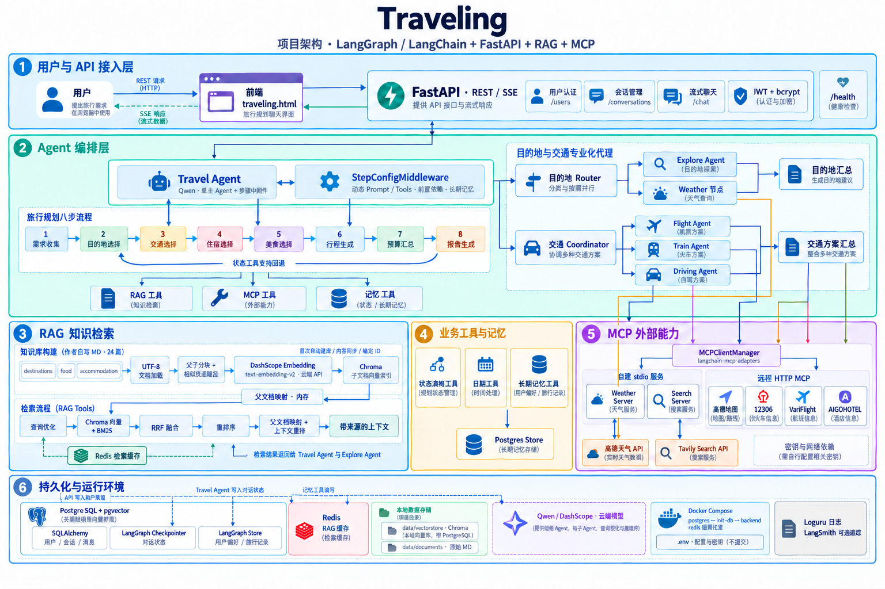

# Traveling

基于 LangGraph / LangChain 多 Agent、RAG 和 MCP 的旅行规划学习项目。后端使用 FastAPI，聊天通过 SSE 返回；前端为单文件页面 `traveling.html`。

支持需求收集、目的地推荐、交通协调、住宿与美食建议，以及行程和预算报告。对话状态、用户和长期记忆保存在 PostgreSQL 中，RAG 索引使用本地 Chroma。

## 项目架构

[](docs/assets/architecture.png)

点击图片可查看大图。主规划流程由一个 Travel Agent 和步骤中间件驱动；目的地 Router 按查询需求分发 Explore / Weather 节点，交通 Coordinator 调用航班、火车、自驾子 Agent。主 Agent 也可直接使用 RAG、MCP 和长期记忆工具。

PostgreSQL 保存业务数据、LangGraph 对话检查点和长期记忆；虽然安装了 pgvector，当前 RAG 的向量检索实际使用本地 Chroma。作者提供的 MD 负责静态知识，云端模型和外部 API / MCP 负责生成与实时查询。

## RAG 知识库说明

**本项目使用作者自行编写、整理的 Markdown 资料，并随仓库提供；无需另外接入开源知识库。** 克隆仓库后即可获得原始资料。当前包含 8 个目的地（长沙、成都、大理、南京、青岛、上海、西安、新疆），每个目的地提供目的地、美食、住宿三类资料，共 24 篇。

```text
data/documents/
├── destinations/    # 景点、城市概况、游玩建议
├── food/            # 当地美食与餐饮建议
└── accommodation/   # 住宿区域与酒店建议
```

这些资料用于学习和功能演示，覆盖范围有限。文档中的票价、酒店价格、营业时间等是静态资料，可能过时；实际出行请核实最新信息。实时天气、地图、搜索、航班和酒店查询由另行配置的外部服务提供。

运行流程为：加载三类 MD → 父子文档切分 → DashScope `text-embedding-v2` 生成向量 → Chroma 与 BM25 混合检索 → 查询优化与重排序 → 返回父文档上下文。

- **原始 MD 随仓库上传；`.venv`、`.env`、日志和 `data/vectorstore/` 不上传。** 每个使用者在自己的机器上生成向量索引。
- **需要自己的 DashScope API Key 和联网环境。** 现有 Embedding、聊天、查询优化及重排序使用云端接口，可能产生费用；项目不提供离线免密钥模式。
- 首次调用 RAG 工具时自动建库；也可以提前执行初始化命令。初次生成向量可能较慢。
- 初始化脚本和运行时使用同一套三类资料。索引按内容和相对来源路径生成稳定 ID，重复初始化不会重复添加分块；增改删文档后同步新增分块并移除旧分块。
- 父文档映射每次初始化从 MD 重建，来源路径相对于 `data/documents/`，避免绑定作者机器的绝对路径。

### 添加或更新资料

将 **UTF-8 编码的 `.md` 文件**放入以上对应目录，也支持子目录。无需修改代码或训练模型。

本地 Python：

```bash
python -m scripts.init_rag
```

Docker 后端已运行时：

```bash
docker compose exec backend python -m scripts.init_rag
docker compose restart backend
```

本地服务在更新后也需要重启，以刷新内存中的 BM25、父文档映射和检索缓存。单进程首次调用 RAG 会自动同步当前资料；请避免在服务处理查询期间同时运行多个初始化进程。知识库为空时会报出明确错误，不会静默建立空索引。

Redis 缓存按知识库内容使用不同命名空间，修改资料并重启后不会命中旧资料的缓存。现已更新 Chroma 及其 LangChain 集成依赖，以避免旧版在 Windows + Python 3.12 上需要编译 `chroma-hnswlib`。如果此前生成的旧版索引无法打开，请先停止服务、将 `data/vectorstore/` 重命名备份，再运行初始化命令从 MD 建立新索引；不需要修改原始 MD。

## 推荐运行方式：Docker Compose

前置条件：安装并启动 Docker（Windows 可使用 Docker Desktop 的 Linux 容器模式），可访问 Python 包仓库、容器镜像仓库和所配置的 API 服务。

### 1. 克隆并配置

```bash
git clone https://github.com/ivyfan-toowell/Traveling.git
cd Traveling
```

Windows PowerShell：

```powershell
Copy-Item .env.example .env
```

Linux / macOS：

```bash
cp .env.example .env
```

编辑 `.env`，至少设置 `DASHSCOPE_API_KEY`、`POSTGRES_PASSWORD`，并建议设置独立的 `JWT_SECRET_KEY`。可使用 Python 生成随机密钥：

```bash
python -c "import secrets; print(secrets.token_urlsafe(32))"
```

`.env.example` 已提供模型名称、地址、端口和数据库名称等默认值。LangSmith 默认关闭，不必提供其密钥。请勿把包含真实密钥的 `.env` 提交到 GitHub。

### 2. 启动

```bash
docker compose up -d --build
```

Compose 会启动 PostgreSQL（带 pgvector）和 Redis，等待数据库就绪，运行 `init-db` 初始化业务表、Checkpointer、Store 和扩展，成功后启动后端。`init-db` 正常退出并显示 `Exited (0)` 是预期行为。

默认访问地址：

- 前端：<http://localhost:14726/>
- API 文档：<http://localhost:14726/docs>
- 服务健康接口：<http://localhost:14726/health>

先在前端注册并登录，再创建对话。健康接口只表示 Web 服务已启动，不保证所有外部 API 可用。

如需提前建立 RAG 索引：

```bash
docker compose exec backend python -m scripts.init_rag
```

查看状态、日志或停止服务：

```bash
docker compose ps -a
docker compose logs --tail=100 init-db backend
docker compose down
```

PostgreSQL / Redis 数据保存到命名卷，MD / 向量库 / 日志保存在本地挂载目录。普通 `down` 保留数据库卷。默认端口仅绑定本机；可以通过 `.env` 的 `APP_PORT` 修改浏览器访问端口，容器内后端端口保持 14726。更改访问端口时也更新 `CORS_ORIGINS`。

## 本地 Python 运行

推荐 Python 3.12，与 Docker 镜像保持一致。请在**仓库根目录**执行以下命令，不要先 `cd scripts`。虚拟环境需要在当前机器重新创建，不能复制作者的 `.venv`。

Windows PowerShell：

```powershell
python -m venv .venv
.\.venv\Scripts\Activate.ps1
python -m pip install -r requirements.txt
```

Linux / macOS：

```bash
python3 -m venv .venv
source .venv/bin/activate
python -m pip install -r requirements.txt
```

按上面的步骤复制、填写 `.env`。可以单独启动 Compose 提供的数据库与缓存：

```bash
docker compose up -d postgres redis
```

或者使用自己已有的 PostgreSQL（安装 pgvector）和 Redis，修改 `.env` 的连接信息。数据库用户需要有建表和创建 `vector` 扩展的权限。内置 Redis 使用空密码。

初始化：

```bash
python -m scripts.init_db
python -m scripts.init_rag
```

Windows：

```powershell
python -m app.run
```

Linux / macOS：

```bash
uvicorn app.main:app --host 0.0.0.0 --port 14726
```

Windows 启动脚本读取 `.env` 的 `APP_HOST` / `APP_PORT`，并设置 Psycopg 异步连接所需的 Selector 事件循环。如果日志显示 Windows stdio 子进程不可用，可优先使用 Docker 运行 MCP 服务。

## 外部接口与配置

| 配置 | 用途与要求 |
| --- | --- |
| `DASHSCOPE_API_KEY` | 必填：Qwen 聊天和 DashScope Embedding |
| `QWEN_MODEL_NAME` / `QWEN_BASE_URL` | 主聊天模型，默认 `qwen-max` 和 DashScope 兼容地址 |
| `POSTGRES_*` | 用户、对话、Checkpointer 和 Store；Compose 内自动使用 postgres 主机 |
| `REDIS_*` | 缓存；Compose 内自动使用 redis 主机和空密码 |
| `JWT_SECRET_KEY` | 建议填写独立随机密钥；当前代码未填时会使用 DashScope Key 签名 |
| `LANGSMITH_API_KEY` / `LANGSMITH_TRACING` | 可选追踪，默认 `false` |
| `AMAP_API_KEY` | 高德天气、地图和路线 |
| `TAVILY_API_KEY` | 联网搜索 |
| `VARIFLIGHT_API_KEY` | 航班查询 |
| `AIGOHOTEL_MCP_API` | 酒店 MCP 查询授权 |

缺少外部密钥、第三方 MCP 服务连接失败或网络受限时，相应查询功能会受限。提供知识库并不等于自带这些服务的授权，也不能保证真实票价、余票或酒店实时库存。

MCP 初始化会跳过未配置密钥的高德、航班和酒店远程服务；自建天气 / 搜索和 12306 按服务发现工具，并限制单个服务发现等待时间。某个服务失败不会清空其他成功加载的工具。自建服务中的真实查询仍需要对应 API Key。

## 项目结构

```text
app/
├── agents/          # 主 Agent、目的地路由与交通子 Agent
├── api/             # 注册、登录、对话和 SSE 聊天
├── core/            # 状态、中间件、Checkpointer、Store
├── mcp_core/        # MCP 客户端与天气 / 搜索服务
├── rag/             # MD 加载、切分、索引、混合检索与重排序
├── tools/           # Agent 工具
├── models/          # SQLAlchemy 数据模型
└── config.py        # 环境配置
scripts/             # 数据库和 RAG 初始化
data/documents/      # 作者提供的 24 篇 Markdown 知识库
traveling.html         # 前端，后端通过 / 提供
```

## API 与测试

API 前缀为 `/api/v1`，包含 `/users`、`/conversations` 和 `/chat`；详细请求格式见 Swagger `/docs`。聊天流返回 `token`、`tool_call`、`done` 和 `error` 等 SSE 事件。

`tests/` 中既有单元检查，也有访问真实 LLM / MCP / 数据库的集成测试。执行全部 `pytest` 前需要配置相应服务，可能调用付费接口。

验证本次可移植性修正可执行以下离线测试，使用本地模拟 Embedding 和 MCP，不调用云端接口，也不启动数据库：

```bash
python -m pytest tests/test_rag_portability.py -q
```

## 使用范围

本项目用于学习与演示，暂未指定开源许可证；上传 GitHub 不代表自动授予二次分发授权。自写知识库属于项目提供的演示内容，使用前请核实信息时效性。
