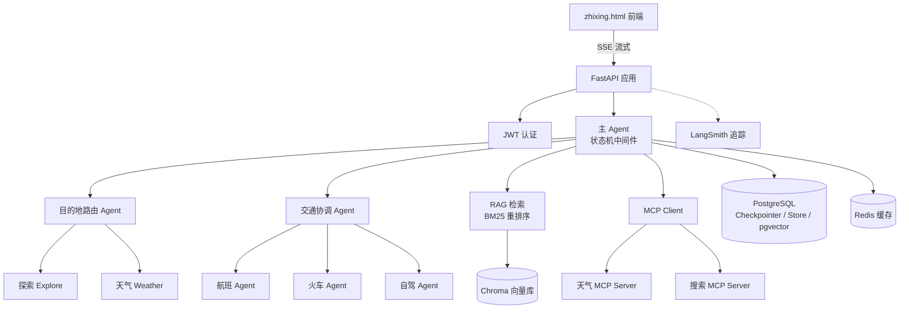

# 知行 ZhiXing · 智能旅行规划助手

一个基于 **LangGraph 多 Agent** + **RAG** + **MCP** 的企业级 AI 旅行规划服务,提供从需求收集、目的地推荐、交通/住宿/美食规划,到生成完整行程与预算报告的一站式体验。

前端为单文件页面 [`zhixing.html`](zhixing.html),后端为 FastAPI + 通义千问(Qwen),对话通过 SSE 流式返回。

---

## ✨ 功能特性

- 🤖 **多 Agent 协作(Handoffs)**:主 Agent 通过状态机式的步骤中间件,按「记录需求 → 选择目的地 → 选择交通 → 选择住宿 → 选择美食 → 生成行程 → 汇总预算 → 生成报告」有序推进
- 🚄 **交通子 Agent**:航班 / 火车 / 自驾三类交通专属子 Agent,由协调器统一调度
- 🗺️ **目的地路由 Agent**:探索(Explore)与天气(Weather)并行,结合高德地图与天气数据
- 📚 **高级 RAG 检索**:父文档切分 + Chroma 向量库 + 混合检索 + BM25 重排序,基于 24 篇目的地/住宿/美食语料
- 🔌 **MCP(Model Context Protocol)**:通过 `fastmcp` + `langchain-mcp-adapters` 接入天气与搜索 MCP Server
- 💾 **持久化记忆**:LangGraph Checkpointer + Store 基于 PostgreSQL(pgvector)保存对话状态与长期记忆,Redis 缓存加速
- 🔐 **用户体系**:JWT 认证 + bcrypt 密码哈希,注册 / 登录 / 会话归属校验
- 📡 **可观测性**:LangSmith 链路追踪 + Prometheus 指标 + loguru 日志
- 🐳 **容器化**:多阶段 Docker 构建,Docker Compose 一键部署

---

## 🏗️ 系统架构



---

## 🧰 技术栈

| 类别 | 技术 |
|------|------|
| 编排框架 | LangGraph 1.x · LangChain 1.x |
| LLM | 通义千问 Qwen(DashScope OpenAI 兼容接口,默认 `qwen-max`) |
| Web 框架 | FastAPI · Uvicorn · SSE 流式 |
| 数据库 | PostgreSQL(pgvector) · Redis |
| 向量库 | ChromaDB + sentence-transformers |
| RAG | 父文档切分 · 混合检索 · BM25 重排序 · jieba 分词 |
| MCP | fastmcp · langchain-mcp-adapters |
| 认证 | PyJWT · bcrypt |
| 可观测性 | LangSmith · Prometheus · loguru |
| 部署 | Docker · docker-compose · uv |

---

## 📁 目录结构

```
travel_planner/
├── app/
│   ├── agents/          # 多 Agent(handoffs 主 Agent、目的地路由、交通子 Agent)
│   ├── api/             # FastAPI 路由(chat / conversations / users)
│   ├── core/            # 状态、中间件、Checkpointer、Store
│   ├── mcp_core/        # MCP 客户端与 Server(weather / search)
│   ├── rag/             # RAG 加载、切分、检索、重排、向量库
│   ├── tools/           # 业务工具(状态流转、RAG、MCP、交通查询等)
│   ├── models/          # SQLAlchemy ORM 模型
│   ├── schemas/         # Pydantic 请求/响应模型
│   ├── utils/           # 日志、安全工具
│   ├── config.py        # pydantic-settings 配置
│   ├── main.py          # FastAPI 入口
│   └── run.py           # Windows 兼容启动脚本(强制 SelectorEventLoop)
├── data/documents/      # RAG 语料(目的地 / 住宿 / 美食,共 24 篇)
├── scripts/             # init_db.py(建库)/ init_rag.py(建向量库)
├── tests/               # 单元测试
├── Dockerfile           # 多阶段构建
├── docker-compose.yml   # 容器编排
├── requirements.txt     # 依赖清单
├── pyproject.toml       # 项目元数据
└── zhixing.html         # 前端页面
```

---

## 🚀 快速开始

### 0. 前置要求

- Python **3.11+**(推荐 3.12)
- PostgreSQL(需启用 `pgvector` 扩展)
- Redis
- 各服务 API Key(见下方「环境变量」)

### 1. 安装依赖

```bash
# 方式一:使用 uv(推荐,Dockerfile 亦采用)
pip install uv
uv pip install -r requirements.txt

# 方式二:直接 pip
pip install -r requirements.txt
```

### 2. 配置环境变量

```bash
cp .env.example .env
# 编辑 .env,填入真实密钥
```

> ⚠️ **切勿将 `.env` 提交到仓库**,其中包含真实 API Key。`.env` 已被 `.gitignore` 排除。

### 3. 初始化数据库

```bash
cd scripts
python init_db.py
```

该脚本会依次创建业务表(用户/会话/消息)、LangGraph Checkpointer 与 Store 表,并启用 `pgvector` 扩展。

### 4. 初始化 RAG 向量库

```bash
python scripts/init_rag.py
```

加载 `data/documents/` 下的语料,切分并写入 Chroma 向量库。

### 5. 启动服务

```bash
# Linux / macOS
uvicorn app.main:app --host 0.0.0.0 --port 14726

# Windows(注意:需使用专用的 run.py 以强制 SelectorEventLoop)
python -m app.run
```

启动后访问:

- 前端页面:`http://localhost:14726/`
- API 文档(Swagger):`http://localhost:14726/docs`
- 健康检查:`http://localhost:14726/`

---

## 🐳 Docker 部署

```bash
docker compose up -d --build
```

Dockerfile 采用多阶段构建(构建依赖 → 拷贝虚拟环境),并内置健康检查。默认端口为 `14726`。

---

## 🔑 环境变量

完整清单见 [`.env.example`](.env.example),关键项如下:

| 变量 | 说明 |
|------|------|
| `DASHSCOPE_API_KEY` | 阿里云 DashScope API Key(必填) |
| `QWEN_MODEL_NAME` | 模型名,默认 `qwen-max` |
| `LANGSMITH_API_KEY` | LangSmith 追踪 Key(可选,用于链路调试) |
| `POSTGRES_HOST` / `POSTGRES_PORT` / `POSTGRES_DB` / `POSTGRES_USER` / `POSTGRES_PASSWORD` | PostgreSQL 连接信息 |
| `REDIS_HOST` / `REDIS_PORT` / `REDIS_DB` / `REDIS_PASSWORD` | Redis 连接信息 |
| `AMAP_API_KEY` | 高德地图 API Key(天气 / 地图) |
| `TAVILY_API_KEY` | Tavily 搜索 API Key |
| `VARIFLIGHT_API_KEY` | Variflight 航班 API Key |
| `AIGOHOTEL_MCP_API` | AIGOHOTEL 酒店获取 API |
| `JWT_SECRET_KEY` | JWT 签名密钥(生产环境务必设置强随机值) |
| `APP_PORT` | 服务端口,默认 `14726` |

---

## 📡 API 接口

所有接口前缀均为 `/api/v1`:

| 方法 | 路径 | 说明 |
|------|------|------|
| POST | `/users/register` | 用户注册 |
| POST | `/users/login` | 用户登录(返回 JWT) |
| GET | `/users/me` | 获取当前用户信息 |
| POST | `/conversations` | 创建会话 |
| GET | `/conversations` | 会话列表 |
| GET | `/conversations/{id}` | 会话详情 |
| PATCH | `/conversations/{id}` | 更新会话(标题 / 状态) |
| DELETE | `/conversations/{id}` | 删除会话(软删除) |
| POST | `/chat/stream/{conversation_id}` | 流式对话(SSE) |
| GET | `/chat/history/{conversation_id}` | 会话历史消息 |

对话接口返回 SSE 事件:`token`(增量文本)、`tool_call`(工具调用)、`done`、`error`。

---

## 🧪 测试

```bash
pytest
```

测试覆盖多 Agent 流程、RAG、MCP、目的地路由等模块,详见 [`tests/`](tests/)。

---

## ⚠️ 安全须知

- 本项目含多个第三方服务密钥,请通过 `.env` 注入,不要硬编码在源码中
- 生产环境请务必设置强随机 `JWT_SECRET_KEY` 并关闭 `DEBUG`
- 若曾误将 `.env` 泄露,请及时在各平台轮换对应 API Key

---

## 📄 License

本项目为学习 / 演示用途,暂未指定开源许可证。如需引用或二次开发,请先联系作者。